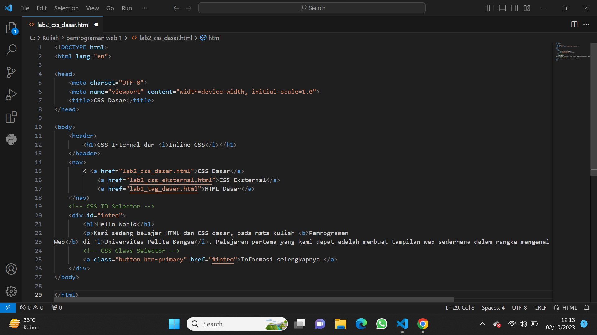
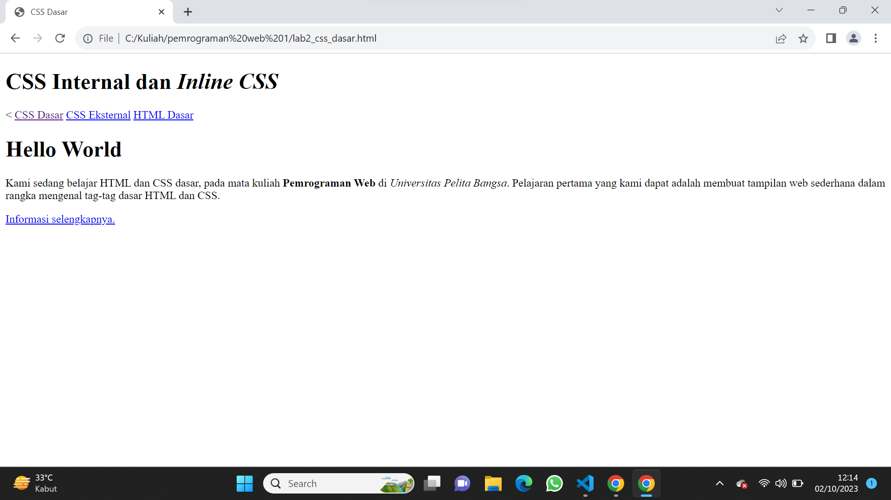
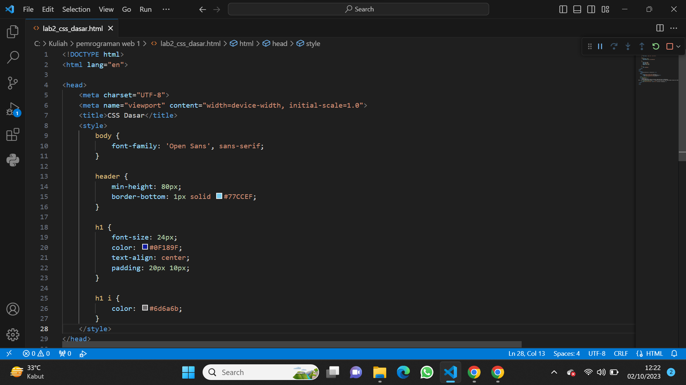
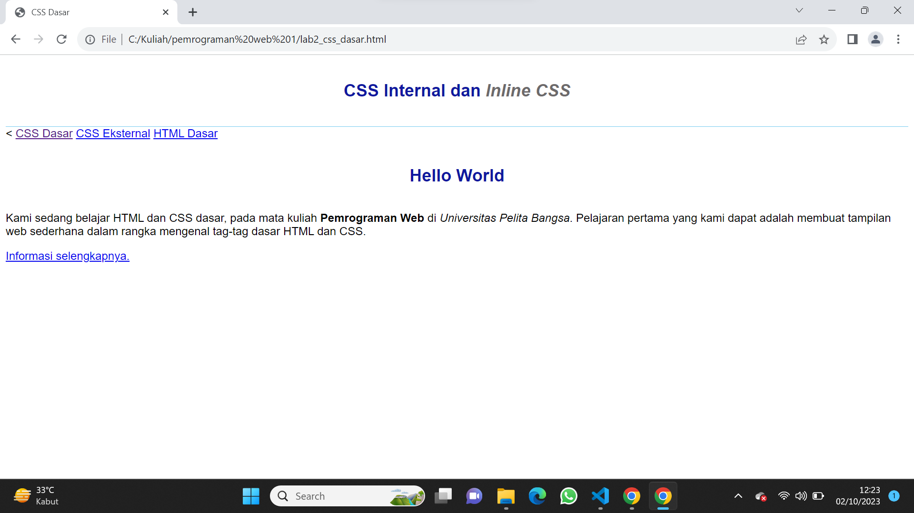
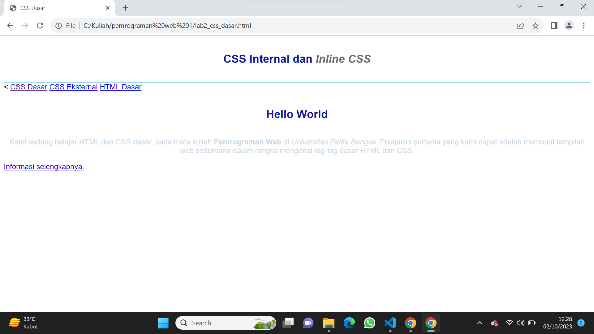
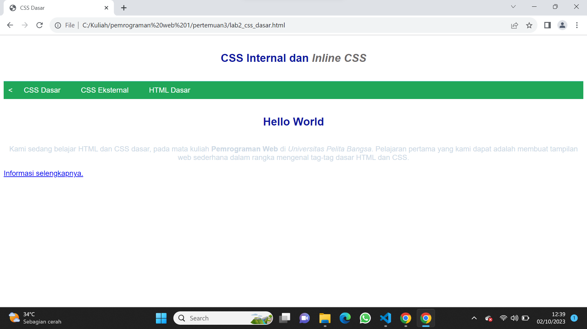
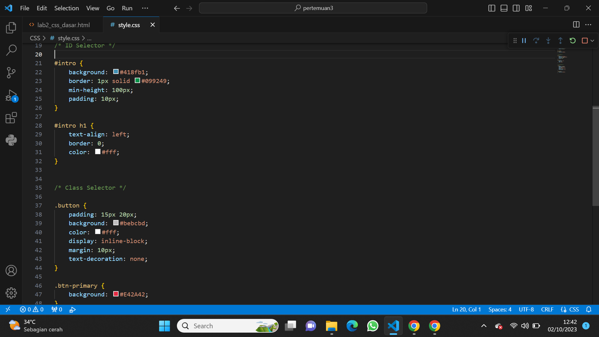
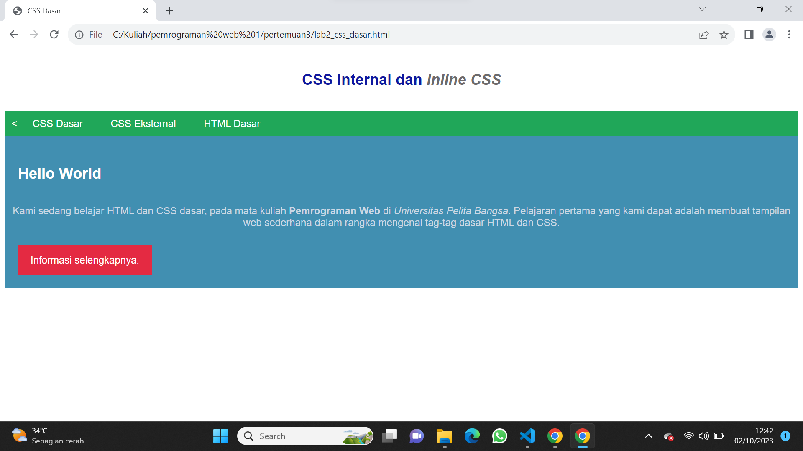

# Lab2Web
# Lab2Web
## Langkah-langkah Praktikum

### Membuat CSS Dasar
### 1. Buatlah dokumen HTML serperti berikut


<p>
<p>

#### Selanjutnya run program dan akan lansung menuju ke browser untuk melihat hasilnya

<p>
<p>

### 2.  Mendeklarasikan CSS Internal
#### Kemudian tambahkan deklarasi css internal seperti di gambar berikut
<p>
<p>


<p>
<p>

#### Selanjutnya simpan perubahan, dan lakukan run lagi untuk melihat hasilnya




### 3. Menambahkan Inline CSS
#### Kemudian tambahkan deklarasi inline CSS pada tag `<p>` seperti berikut. <p>
`<p style="text-align: center; color: #ccd8e4;">`
<p> 

#### Simpan kembali dan refresh kembali browser untuk melihat perubahannya
<p>


<p>
<p>

### 4. Membuat CSS Eksternal
#### Buat file baru terlebih dahulu dengan nama `style_.css` kemudian bautlah deklarasi CSS seperti berikut
<p>
<p>


<p>
<p>

Kemudian tambahkan tag `<link>` untuk menuju file css yang sudah dibuat pada bagian `<head>`
<p>

`<head>`

`<!-- menyisipkan css eksternal --> <link rel="stylesheet" href="style_eksternal.css" type="text/css">`

`<head>`
 
### 5. Menambahkan CSS Selector
#### Selanjutnya menambahkan CSS Selector menggunakan ID dan Class Selector. buka kembali file `style_eksternal.css` dan tambahkan command seperti yang ada pada gambar berikut
<p>
<p>


<p>
<p>

#### Kemudian simpan kembali dan run untuk melihat hasil perubahannya


#### Pertanyaan 
1. Lakukan eksperimen dengan mengubah dan menambah properti dan nilai pada kode CSS
dengan mengacu pada CSS Cheat Sheet yang diberikan pada file terpisah dari modul ini.
2. Apa perbedaan pendeklarasian CSS elemen h1 {...} dengan #intro h1 {...}? berikan
penjelasannya!
3. Apabila ada deklarasi CSS secara internal, lalu ditambahkan CSS eksternal dan inline CSS pada
elemen yang sama. Deklarasi manakah yang akan ditampilkan pada browser? Berikan
penjelasan dan contohnya!
4. Pada sebuah elemen HTML terdapat ID dan Class, apabila masing-masing selector tersebut
terdapat deklarasi CSS, maka deklarasi manakah yang akan ditampilkan pada browser?
Berikan penjelasan dan contohnya! (<p id="paragraf-1" class="text-paragraf">)

#### Jawaban
1. 
```css
body {
    font-family: 'Open Sans', sans-serif;
    margin: 0; 
}
header {
    background: #f0f0f0;
}

nav {
    margin-top: 20px;
}

nav a {
    display: inline-block;
    margin-right: 10px;
}
#intro {
    background: #418fb1;
    border: 2px solid #099249;
    min-height: 120px; 
    padding: 20px; 
}
#intro p {
    font-style: italic; 
}

.button {
    border-radius: 5px;
}

.btn-primary:hover {
    background: #d62939;
}
```
2. h1 {...}: Ini adalah pendeklarasian CSS untuk elemen h1 secara umum. Ini akan mempengaruhi semua elemen h1 di halaman web, tidak peduli di mana mereka berada.
intro h1 {...}: Ini adalah pendeklarasian CSS untuk elemen h1 yang berada di dalam elemen dengan id "intro". Hal ini akan mempengaruhi elemen h1 yang terdapat dalam elemen dengan id "intro" saja.
3.  Inline CSS (Highest Priority) : Deklarasi CSS yang ada dalam atribut stylepada elemen HTML akan memiliki prioritas tertinggi dan akan ditampilkan.

- CSS Internal : Deklarasi CSS yang ada di dalam tag <style>secara internal akan memiliki prioritas di bawah inline CSS dan di atas CSS eksternal.

- CSS Eksternal (Prioritas Terendah) : Deklarasi CSS yang terdapat dalam file eksternal yang dihubungkan melalui tag <link>akan memiliki prioritas paling rendah.
4. Inline style : Ini adalah deklarasi CSS yang ditempatkan langsung dalam atribut styleelemen HTML. Mereka memiliki prioritas tertinggi.

- ID selector : Deklarasi yang menggunakan ID selector (ditandai dengan #) memiliki prioritas lebih tinggi daripada class selector.

- Pemilih kelas : Deklarasi yang menggunakan pemilih kelas (ditandai dengan .) memiliki prioritas lebih rendah daripada penyeleksi ID.

- Pemilih elemen : Jika tidak ada gaya inline, penyeleksi ID, atau penyeleksi kelas yang cocok, maka deklarasi dengan menggunakan elemen pemilih (misalnya p) akan digunakan.
   